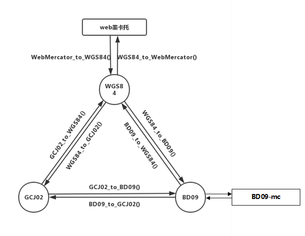

# CoordTransform

坐标系转换



## wgs、bd、gcj 坐标系两两互转

```python
from coordTransform_py import *
lng = 128.543
lat = 37.065
result1 = gcj02_to_bd09(lng, lat)
result2 = bd09_to_gcj02(lng, lat)
result3 = wgs84_to_gcj02(lng, lat)
result4 = gcj02_to_wgs84(lng, lat)
result5 = bd09_to_wgs84(lng, lat)
result6 = wgs84_to_bd09(lng, lat)
```

## `百度墨卡托`和`百度经纬度`互换

转换代码源于: https://github.com/spencer404/go-bd09mc

```python
from coordTransform_bd import bd_mc_to_coord, bd_coord_to_mc
x, y = bd_coord_to_mc(113, 22)
lng, lat = bd_mc_to_coord(x, y)
```
